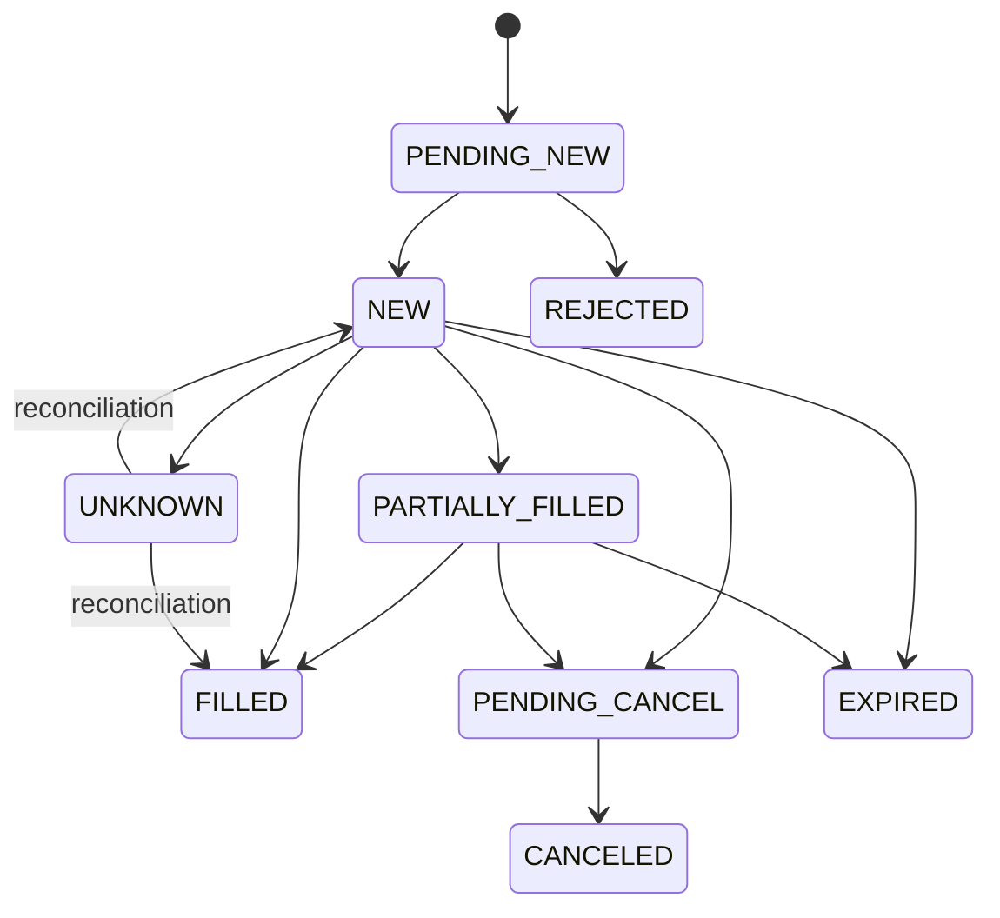

# ALPHA PROOF Ω — Execution-Ready Lab

الإصدار: `9.9.5-execution-lab.1`، مبني على الملف المرفق «التحدي 5(1).zip».

هذه طبقة تنفيذ تجريبية تعمل داخل المشروع: Paper فعلي داخل المحاكي، وخطط Testnet غير مرسلة. **لا يوجد ناقل أو موقّع أو مفتاح لتداول حقيقي، ولا مسار برمجي لتفعيله.** وجود `LIVE_EXECUTION_ENABLED=false` تدعمه هذه البنية؛ تغيير متغير بيئة لا يضيف ناقلًا مفقودًا.

## تركيب التحديث

1. أوقف الخادم وخذ نسخة من المشروع ومن مجلد البيانات الدائم قبل استبدال ملفات الكود.
2. فك ملف التحديث فوق **جذر النسخة المرفقة نفسها**، مع الحفاظ على المسارات. يحتوي التحديث على الملفات المعدلة والجديدة فقط. راجع `docs/PATCH-MANIFEST.json` لمعرفة المسارات وبصمات النسخة الأصلية والمعدلة.
3. لا تستبدل أو تحذف `data/` أو `/data` أو قواعد التعلم أو Brain أو Checkpoints. التحديث لا يحتوي بيانات تشغيل بديلة.
4. استخدم Node.js 20 أو أحدث. لا تحتاج الطبقة إلى حزم npm خارجية جديدة.
5. نفّذ `npm run check` ثم `npm test` ثم شغّل `npm start`.

```bash
npm run check
npm test
npm start
```

اختبار المشروع القديم يتضمن تشغيل خوادم مؤقتة. أجرِ الاختبارات على نسخة عمل منفصلة، لا داخل عملية الإنتاج الجارية.

## إعداد Paper

اضبط على الخادم رمز تحكم عشوائيًا بطول 32–256 حرفًا. الرمز **ليس مفتاح Binance**. لا توجد حاجة إلى مفاتيح منصة في هذه النسخة. مثال لتوليد قيمة جديدة على جهازك:

```bash
node -e "console.log(require('node:crypto').randomBytes(32).toString('base64url'))"
```

| المتغير | القيمة / السلوك |
| --- | --- |
| `EXECUTION_CONTROL_TOKEN` | رمز التحكم. غيابه أو قصره يغلق كل عمليات التعديل في واجهة التنفيذ. |
| `EXECUTION_MODE` | `PAPER` فقط. `LIVE` و`BINANCE` وأي قيمة أخرى تُقفل الطبقة. |
| `EXECUTION_INITIAL_USDT` | `10000` افتراضيًا، رصيد محاكاة مستقل، يثبت عند إنشاء السجل. |
| `EXECUTION_RISK_JSON` | كائن JSON اختياري بالحدود أدناه؛ قيم USDT سلاسل عشرية. يثبت عند إنشاء السجل. |
| `EXECUTION_DATA_DIR` | اختياري؛ الافتراضي `<DATA_DIR>/execution-lab`. يجب أن يكون على تخزين دائم. |
| `EXECUTION_ALLOWED_ORIGINS` | للواجهة المستضافة على نطاق آخر: أصول كاملة مثل `https://example.github.io`، مفصولة بفواصل دون مسارات أو فراغات. |

في Railway استخدم Volume دائمًا لمسار البيانات. في VPS شغّل **عملية كاتبة واحدة** لهذا الحساب. ملف القفل يمنع عمليتين من الكتابة إلى السجل نفسه. لا تحذف القفل أثناء عمل العملية. تستخدم الواجهة HTTPS في التشغيل البعيد لحماية رمز التحكم أثناء نقله.

افتح تبويب **التنفيذ**، وأدخل رمز التحكم في الحقل. لا تحفظه الواجهة في LocalStorage أو Cookies. يظهر نموذج أمر للعملات المؤهلة في رادار Lux وللمراكز المملوكة في حساب التنفيذ. إذا لم تظهر عملات، نفّذ الفحص المعتاد وانتظر قبول Lux؛ لا توجد قائمة بديلة تتجاوز البوابة.

اختر Paper، والزوج، والكمية **بالعملة الأساسية**، ونوع الأمر. أنشئ خطة، ثم نفّذها في Paper. صلاحية المعاينة 15 ثانية، ويُعاد التحقق من الأسعار والفلاتر والمخاطر وقت الإرسال؛ لذلك قد تختلف التقديرات. النتائج، والأسعار الفعلية داخل المحاكي، والكميات، والرسوم ظاهرة في الجداول.

عند فقدان الرد أعد الطلب **بالمعرّف نفسه والمحتوى نفسه**. لا تنشئ معرّفًا جديدًا حتى تتأكد من حالة السابق. إعادة المعرّف لا تعيد التنفيذ، وتغيير المحتوى تحت المعرّف نفسه مرفوض. حتى الأمر المرفوض يحتفظ بهويته وسبب رفضه؛ لإنشاء نية مختلفة استخدم «طلب جديد».

النسخة المحلية المستقلة من `index.html` تستطيع عرض أدوات البحث القديمة، لكن **التنفيذ يحتاج الخادم** ولا ينتقل إلى تنفيذ محلي بديل عند انقطاعه.

## ما بُني

| الجزء | السلوك |
| --- | --- |
| دفتر التنفيذ | منفصل عن محفظة Shadow/التعلم القديمة؛ لا تُعاد تسمية نتائج الماضي إلى تنفيذ مؤكد. |
| الدقة | BigInt بدقة 12 منزلة؛ مبالغ وكميات API سلاسل عشرية، لا أرقام عائمة. قيم غير محدودة أو سالبة أو غير صالحة مرفوضة. |
| الأوامر | Market، Limit، GTC مع مهلة، IOC، FOK؛ قبول، تنفيذ جزئي، اكتمال، إلغاء، انتهاء، رفض، وحالة غير مؤكدة. |
| الأرصدة | حجز النقد مع الرسوم للأوامر الشرائية، وحجز الكمية للأوامر البيعية؛ دون اقتراض أو بيع مكشوف. |
| المطابقة | مقارنة دفتر الأوامر والأرصدة والمراكز والتعبئات بسجل حقائق وسيط Paper؛ التباين يوقف التنفيذ، ولا يولّد أمرًا تصحيحيًا. |
| تقارير التنفيذ | لا تدخل المحاسبة إلا تعبئة موجودة أصلًا في سجل وسيط Paper؛ تكرارها لا يُحتسب مرتين. لا تقبل HTTP تعبئات أو أرصدة يرسلها العميل. |
| الحفظ | دفعات أحداث مترابطة ببصمات SHA-256 و`fsync` قبل التأكيد، مع إعادة تشغيل من السجل. |
| Kill Switch | يمنع الأوامر الجديدة، ويلغي الأوامر المعلقة المعروفة، ويحرر حجوزاتها. لا يبيع المراكز تلقائيًا. |
| الاستعادة | إعادة التشغيل تبقي الطبقة موقوفة. تُجرى المطابقة، ثم يتطلب الاستئناف ضغطًا صريحًا وبيانات حديثة وحدود مخاطر سليمة. |
| المسار الآمن | لا شراء إلا لزوج Spot/USDT مقبول في Lux. إذا خرج الزوج من الرادار، يُلغى أمر الشراء المعلق. يسمح بالبيع من مخزون التنفيذ الموجود. |
| الحساب اليومي | يوم التداول موحّد مع شمعة Binance `1D`: الحد عند `00:00 UTC` (افتتاح الشمعة اليومية الجديدة). اليوم و7 أيام والتراكمي محفوظة، ولا يغيّر منتصف الليل المحلي حدود المخاطر. الخسائر التراكمية والتراجع من القمة لا يُمحَيان عند انتقال يوم Binance. يستمر تقييم المراكز أثناء الإيقاف. |

تتبع الأوامر الانتقالات المسموحة، ومنها:



يُحفظ رفض فحص المخاطر كحالة `REJECTED` قبل إنشاء أمر لدى وسيط Paper. الحالات غير المؤكدة لا تُعاد محاولة إرسالها تلقائيًا؛ المطابقة تسترجع الحالة المعروفة، ويبقى الإيقاف فعالًا حتى الاستئناف.

## حدود البداية

هذه أرقام اختبار افتراضية لحساب Paper، وليست توصية لحساب ممول.

| الإعداد | الافتراضي |
| --- | --- |
| `maxOrderUSDT` | `"250"` |
| `maxSymbolUSDT` | `"2000"` |
| `maxGrossUSDT` | `"5000"` |
| `maxDailyLossUSDT` | `"200"`، يشمل أثر التقييم والرسوم |
| `maxDrawdownUSDT` | `"1000"` من أعلى قيمة حساب مسجلة |
| `maxOpenOrders` | `10` |
| `maxPositions` | `10` أزواج، بما فيها حجوزات شراء أزواج جديدة |
| `maxOrdersPerMinute` | `20`، ويشمل الأوامر المرفوضة المحفوظة |
| `maxQuoteAgeMs` | `15000` |
| `maxSpreadBps` | `50`، أي 0.50% |
| `maxSlippageBps` | `25`، أي 0.25%، مع التحقق بعد تقريب السعر |
| `paperSlippageBps` | `5`، أي 0.05%، علاوة على السبريد |
| `participationBps` | `1000`، أي 10% من كمية أفضل مستوى في لقطة الكتاب |

مثال إعداد قبل إنشاء حساب Paper جديد:

```json
{"maxOrderUSDT":"100","maxSymbolUSDT":"500","maxGrossUSDT":"1500","maxDailyLossUSDT":"100","maxDrawdownUSDT":"500","maxPositions":5}
```

تغيير الرصيد الابتدائي أو حدود المخاطر عند إعادة فتح السجل نفسه يُقفل الطبقة برسالة `EXECUTION_CONFIGURATION_CHANGED`. أعد القيم المطابقة للسجل، أو ابدأ تجربة جديدة في **مجلد تنفيذ جديد** مع إبقاء السجل القديم محفوظًا. لا تُحذف بيانات التعلم، ولا تُعدّل الأرصدة يدويًا لإسكات خطأ المطابقة.

## API

كل POST أدناه يحتاج `Authorization: Bearer <EXECUTION_CONTROL_TOKEN>` و`Content-Type: application/json`. العميل لا يحدد رابط المنصة أو الأسعار أو الفلاتر أو الأهلية؛ يجلبها الخادم من مصدره العام المحدد.

| المسار | الوظيفة |
| --- | --- |
| `GET /api/execution/state` | الحالة والحدود والمحفظة والأوامر والتعبئات الحديثة؛ دون رمز التحكم. |
| `POST /api/execution/plans` | فحص نية أمر وإنشاء معاينة Paper أو خطة Testnet. |
| `POST /api/execution/orders` | قبول أمر Paper فقط. |
| `POST /api/execution/cancel` | `{ "clientOrderId": "ap-example01" }` |
| `POST /api/execution/kill` | `{}`؛ إيقاف وإلغاء المعلق دون تصفية. |
| `POST /api/execution/reconcile` | `{}`؛ لا يقبل ميزانية بديلة أو لقطة منصة من العميل. |
| `POST /api/execution/resume` | `{}`؛ يعيد المطابقة وفحص المخاطر والأسعار. |

نية Market:

```json
{"mode":"PAPER","clientOrderId":"ap-example01","symbol":"BTCUSDT","side":"BUY","type":"MARKET","quantity":"0.001","ttlMs":900000}
```

نية Limit:

```json
{"mode":"PAPER","clientOrderId":"ap-example02","symbol":"BTCUSDT","side":"BUY","type":"LIMIT","quantity":"0.001","price":"50000","timeInForce":"GTC","ttlMs":900000}
```

الأسعار والكميات أمثلة شكلية؛ قد تُرفض حسب السعر والفلاتر والأهلية الحالية. يقبل السوق المحلي أيضًا `plan.intent` كما أعادته المعاينة. لا تخفف هذه الأمثلة قيود المخاطر.

تظهر حالة الطبقة كذلك في `/api/state`، وحالة القفل في `/health`. بقيت واجهات البحث القديمة كما هي؛ رمز التنفيذ لا يحوّل التطبيق القديم كله إلى نظام مستخدمين وصلاحيات. استخدم حماية وصول للخادم إذا كان متاحًا على الإنترنت.

## الأعطال والتشغيل المستمر

- إذا فشل الحفظ لا يُؤكد الأمر؛ تُقفل الطبقة. إن كانت الدفعة قد وصلت إلى القرص قبل فقدان الرد، تستعاد عند الإقلاع، ثم تُفحص بالمعرّف نفسه.
- تُحذف فقط النهاية غير المكتملة لسطر أحداث لم يكتمل حفظه. يبقى السجل الملتزم قبلها ويظل التنفيذ موقوفًا. فساد سطر كامل يقفل الطبقة دون إنشاء محفظة بديلة أو الكتابة فوق الملف الفاسد.
- في `RECONCILIATION_MISMATCH` لا يُسمح باستبدال الرصيد عبر API. احتفظ بالسجل وراجع سبب الفرق. المطابقة تعالج حالة انتظار/عدم يقين فقط عندما تتفق حقائق الأرصدة والكميات والتعبئات.
- فشل بيانات السوق يوقف الأوامر، لكنه لا يمحو المراكز. البيانات القديمة معلمة بوضوح. بيانات أعمار الفلاتر الأكبر من ساعة مرفوضة.
- لا يوجد جلب بيانات إضافي إذا لم توجد مراكز أو أوامر مفتوحة. أثناء وجودها، تُحدَّث البيانات كل 5 ثوانٍ بتوازٍ محدود. لا يُكتب تقييم جديد عندما لم تتغير قيمة الحساب أو `tradingDayId` الخاص بيوم Binance.
- حدود هذه النسخة: 1000 هوية أمر و20000 تعبئة و256 MiB لسجل الأحداث للحساب الواحد. الوصول للسعة يوقف قبول المزيد؛ لا تُحذف الهويات لتجاوز منع التكرار. ابدأ تجربة مستقلة بمجلد جديد بعد حفظ القديمة.
- تعتمد اليوميات على عينات التقييم وحدّ `tradingDayId` الموحد مع Binance 1D. التغير عبر فجوة دون بيانات يُسجل عند أول عينة لاحقة؛ لا تُخترع قيمة عند الحد اليومي. الإجمالي والرسوم والتراجع يظلون محفوظين.

## حدود الإثبات

Paper يحاكي أفضل سعر شراء/بيع وكمية متاحة محدودة، ورسومًا ثابتة دون BNB، وانزلاقًا إضافيًا. يجمع الكمية المستهلكة بين الأوامر التي تستخدم اللقطة نفسها، بما فيها بعد إعادة التشغيل. Market يستخدم تنفيذًا فوريًا محدودًا وتُنهى الكمية المتبقية. FOK لا ينفذ جزئيًا. لا يوجد نموذج كامل لطابور الأوامر أو عمق جميع مستويات الكتاب أو زمن استجابة منصة حقيقية.

المطابقة هنا **مطابقة مع وسيط Paper محلي مستقل في إسقاط الأرصدة والأوامر**، وليست مطابقة مع حساب Binance. الطرفان محفوظان في سجل معاملات واحد؛ لا يُدّعى استقلالهما كمنصتين خارجيتين أو وجود تدقيق طرف ثالث.

Testnet يعيد وصفًا غير موقّع لـ `/api/v3/order` ومسار التحقق `/api/v3/order/test` على نطاق Testnet المحدد، ولا ينفذ أيًا منهما. فلاتر المعاينة من مصدر Spot العام لأغراض المختبر؛ قبل أي ربط Testnet لاحق يلزم جلب فلاتر وأرصدة Testnet نفسها ومراجعة ناقلها. التحقق المحلي للفلاتر ليس قبولًا مؤكدًا من منصة.

لا توجد WebSocket User Data Stream، أو مفاتيح تداول، أو إرسال حقيقي، أو تفعيل تلقائي بعد عدد معين من الأرباح. يلزم عمل مستقل للناقل الشبكي واختبارات انقطاعه ومراجعة مستقلة قبل أي مرحلة مختلفة. هذه النسخة لا تدعي الربحية أو الجاهزية لأموال حقيقية.

السلسلة المشفرة تكشف التلف وعدم اتساق السجل؛ ليست توقيعًا من طرف مستقل ولا تحمي من شخص يملك الملفات ويعيد كتابة السلسلة كاملة. يلزم نسخ احتياطي خارجي موثوق لحماية التخزين.

مراجع الحقول والفلاتر: [Binance Spot Filters](https://developers.binance.com/en/docs/products/spot/filters)، [Binance Spot Testnet REST](https://developers.binance.com/en/docs/products/spot/testnet/rest-api). لا يعادل `/order/test` تعبئة من محرك المطابقة.
